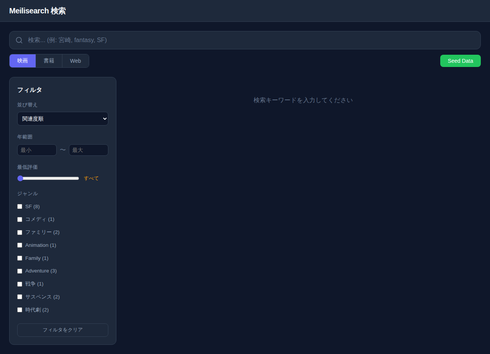
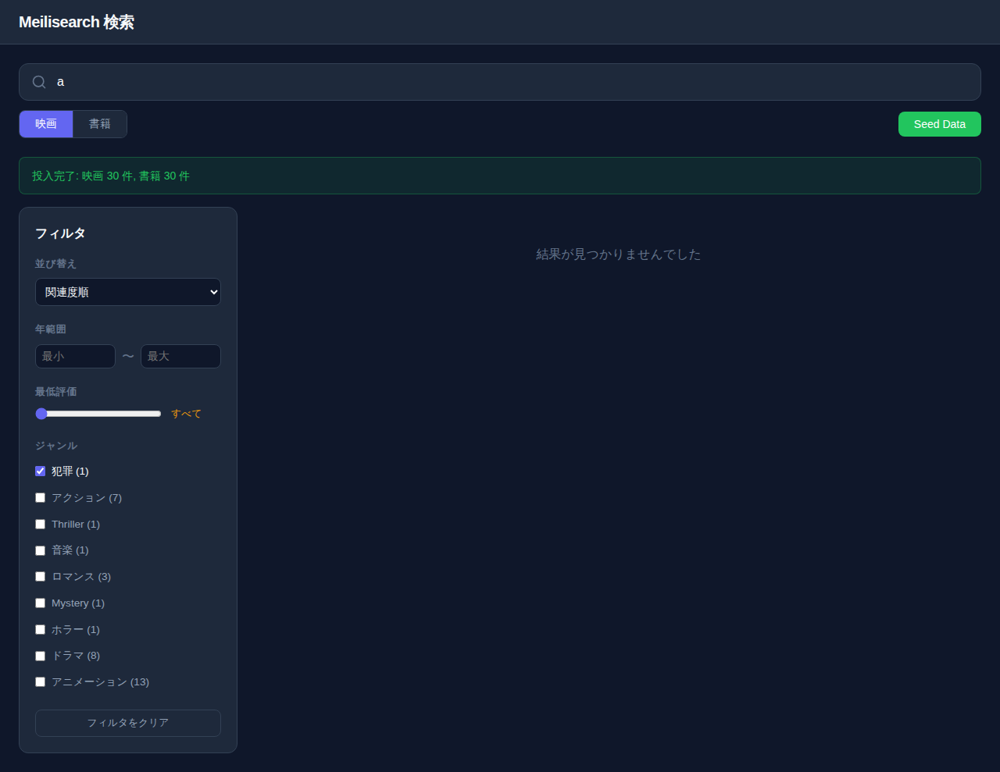
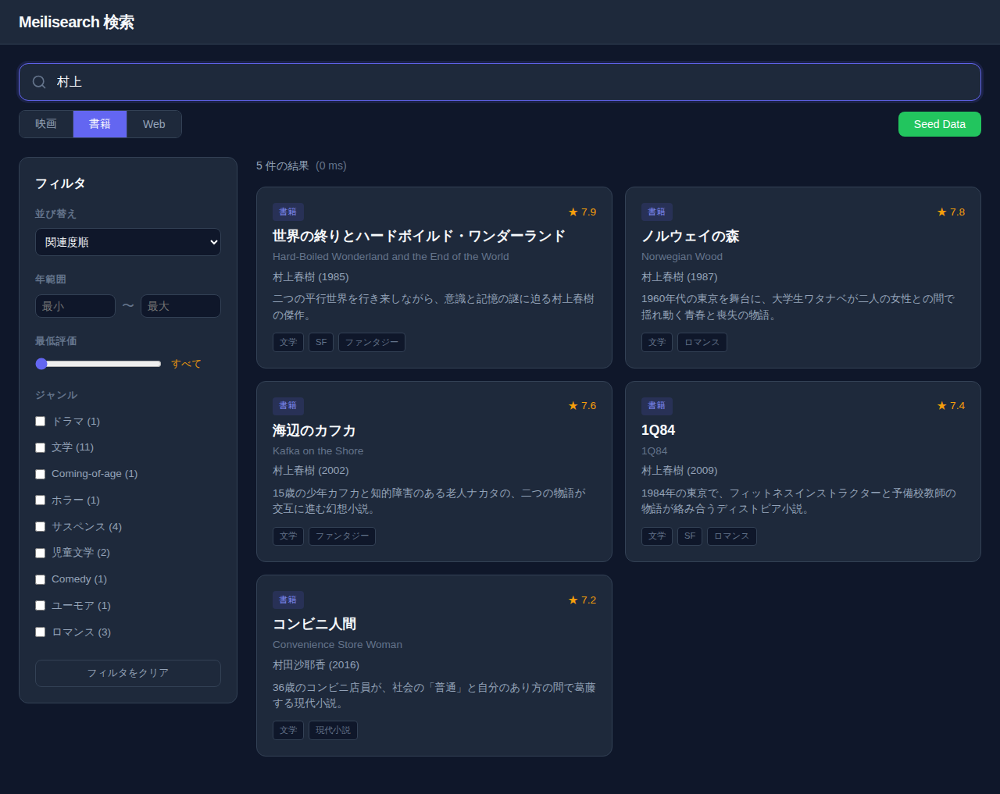
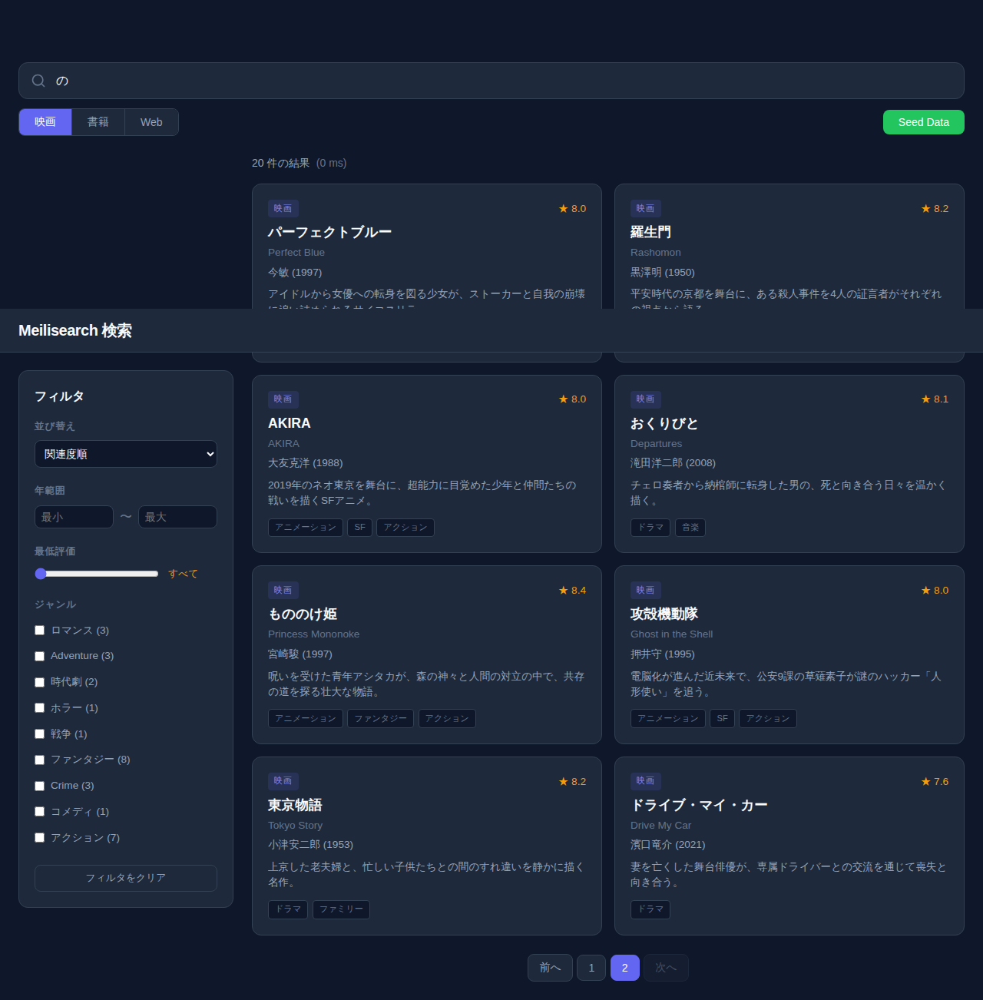
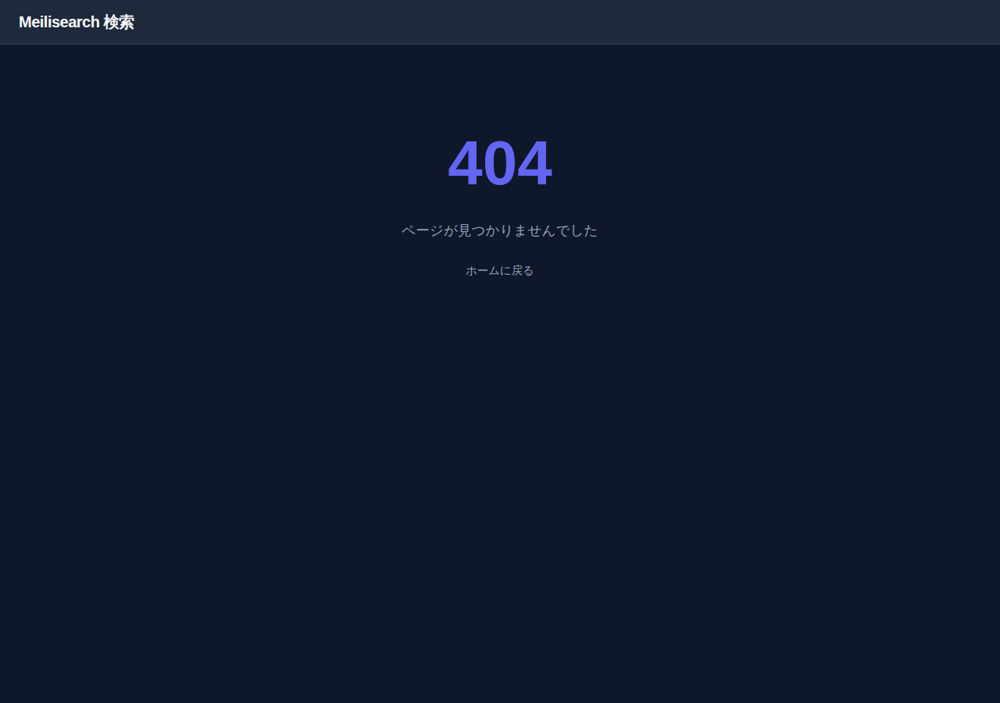

# Meilisearch 検索

映画・書籍のカタログデータを Meilisearch で全文検索できる Web サービス。
日本語・英語の混合データに対応し、ファセットフィルタ (ジャンル・年・評価) やソート、ページネーションを備えています。



## 主な機能

- **全文検索** — 日本語・英語のタイトル / あらすじ / 監督名・著者名をリアルタイム検索 (300ms デバウンス)
- **ファセットフィルタ** — ジャンル (件数付きチェックボックス)、年範囲、最低評価スライダー
- **ソート** — 関連度 / 年 / 評価 / タイトル順
- **インデックス切替** — 映画 (30 件) と書籍 (30 件) をワンクリックで切り替え
- **詳細ページ** — 各作品のタイトル / 英題 / 監督・著者 / 年 / ジャンル / 評価 / あらすじを表示
- **ページネーション** — 12 件ごとにページ分割
- **SSR + WASM** — サーバーサイドレンダリングによる高速な初期表示 + クライアント側ハイドレーション
- **ダークテーマ** — インディゴを基調としたモダンなダーク UI
- **レスポンシブ** — デスクトップ / タブレット / モバイル対応

| 検索 + フィルタ | 書籍インデックス |
|:---:|:---:|
|  |  |

| ページネーション | 404 ページ |
|:---:|:---:|
|  |  |

## 技術スタック

| レイヤー | 技術 | バージョン |
|---|---|---|
| フロントエンド | [Leptos](https://github.com/leptos-rs/leptos) (SSR + WASM hydration) | 0.8 |
| HTTP サーバー | [Actix-web](https://actix.rs/) (leptos_actix 統合) | 4 |
| 検索エンジン | [Meilisearch](https://www.meilisearch.com/) | v1.15 |
| 検索 SDK | meilisearch-sdk (SSR only) | 0.32 |
| ユーティリティ | leptos-use (`signal_debounced`) | 0.18 |
| ビルドツール | cargo-leptos (nightly Rust) | 0.3 |
| インフラ | Docker Compose | - |

## クイックスタート

### 前提条件

- Docker & Docker Compose

### 環境変数の設定

```bash
cp .env.sample .env
```

必要に応じて `.env` 内の値を変更してください。

### 起動

```bash
docker compose up
```

以下のサービスが起動します:

| サービス | URL |
|---|---|
| Web アプリ | http://localhost:3000 |
| Meilisearch | http://localhost:7700 |

### 使い方

1. ブラウザで http://localhost:3000 を開く
2. **Seed Data** ボタンをクリックしてサンプルデータを投入 (映画 30 件 + 書籍 30 件)
3. 検索バーにキーワードを入力 (例: `宮崎`, `fantasy`, `SF`)
4. ファセットパネルでジャンル / 年 / 評価を絞り込み
5. **映画** / **書籍** ボタンでインデックスを切替
6. カードをクリックして詳細ページを表示

## プロジェクト構成

```
src/
├── lib.rs              # モジュール宣言 + hydrate() エントリ
├── main.rs             # Actix-web サーバー起動 (SSR)
├── app.rs              # ルート App コンポーネント + Router
├── api.rs              # #[server] 関数 (検索・CRUD・seed・facets)
├── model/              # データモデル (Movie, Book, SearchResponse 等)
├── server/             # SSR 専用 (Meilisearch クライアント, seed)
├── pages/              # ページコンポーネント (home, detail, not_found)
└── components/         # UI コンポーネント (search_bar, facet_panel 等)

seed/                   # サンプル JSON データ (映画 30 件, 書籍 30 件)
style/main.scss         # SCSS スタイル (ダークテーマ)
tests/                  # ブラウザ自動テスト (Puppeteer)
docs/evidence/          # テストスクリーンショット + 検証レポート
```

## 開発

### ローカル開発 (cargo-leptos)

```bash
# Meilisearch のみ起動
docker compose up meilisearch

# 開発サーバー起動 (ホットリロード)
cargo leptos watch
```

### ビルド確認

```bash
# SSR 側
cargo check --features ssr

# WASM 側
cargo check --target wasm32-unknown-unknown --features hydrate --no-default-features
```

### Docker ビルド

```bash
docker compose build app
docker compose up
```

## API

Leptos の `#[server]` マクロで実装されたサーバー関数:

| 関数 | 用途 |
|---|---|
| `search_items` | ファセット検索 + フィルタ + ソート + ページネーション |
| `get_movie` / `get_book` | 詳細取得 |
| `create_movie` / `create_book` | 新規作成 |
| `update_movie` / `update_book` | 更新 |
| `delete_movie` / `delete_book` | 削除 |
| `seed_data` | サンプルデータ一括投入 |
| `get_facets` | ファセット情報取得 |

## サンプルデータ

### 映画 (30 件)

宮崎駿作品 (千と千尋の神隠し, もののけ姫, となりのトトロ 等)、クリストファー・ノーラン作品 (インターステラー, ダークナイト 等)、その他名作を日英混合で収録。

### 書籍 (30 件)

村上春樹作品 (ノルウェイの森, 海辺のカフカ, 1Q84 等)、夏目漱石、トールキン、オーウェル等の名著を日英混合で収録。

## テスト

Puppeteer による自動ブラウザテスト (15 シナリオ):

```bash
# アプリが起動している状態で実行
node tests/browser-verify.mjs
```

テスト結果のスクリーンショットは `docs/evidence/` に、レポートは `docs/evidence/REPORT.md` に出力されます。

## 環境変数

| 変数 | デフォルト | 説明 |
|---|---|---|
| `MEILI_URL` | `http://localhost:7700` | Meilisearch の接続先 URL |
| `MEILI_MASTER_KEY` | `masterKey` | Meilisearch のマスターキー |

## ライセンス

MIT
